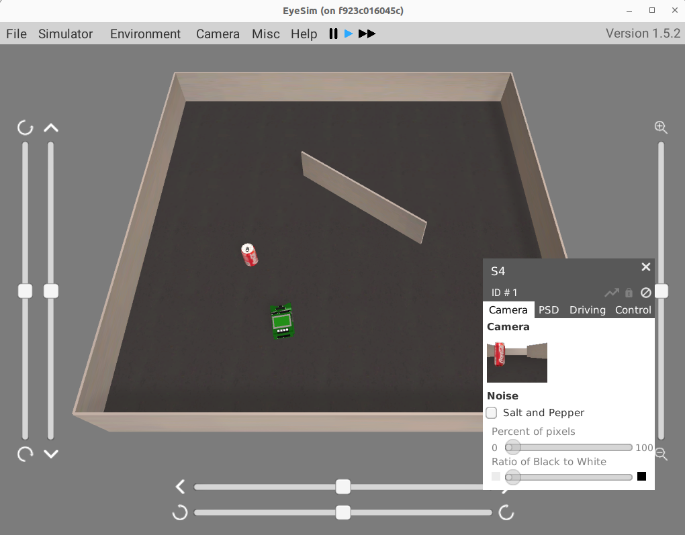

# eyesim-docker
Docker images for EyeSim 

## How to Use
Make sure you have a docker  
Select your programming language: c/cpp/python

### C
```
docker build -f c.Dockerfile -t eyesim1.5.2:latest -t eyesim1.5.2:c . 
```
### C++
```
docker build -f cpp.Dockerfile -t eyesim1.5.2:latest -t eyesim1.5.2:cpp . 
```
### Python
```
docker build -f python.Dockerfile -t eyesim1.5.2:latest -t eyesim1.5.2:python . 
```

### 
```
docker compose up
```



## Support Version
```ubuntu 20.04``` ```EyeSim version 1.5.2```

## Roadmap
- [x] Readme
- [x] Dockerfile
- [ ] Random drive
